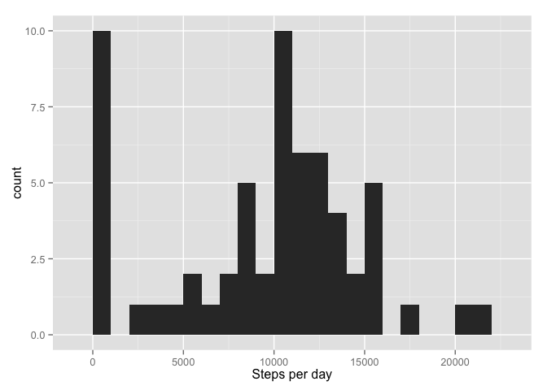
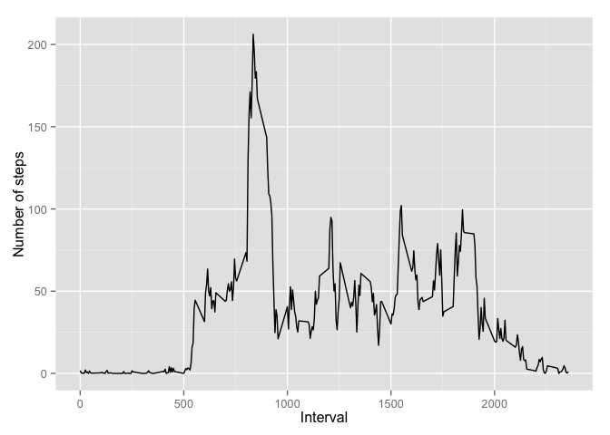
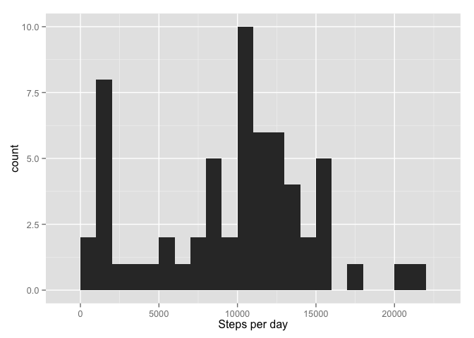
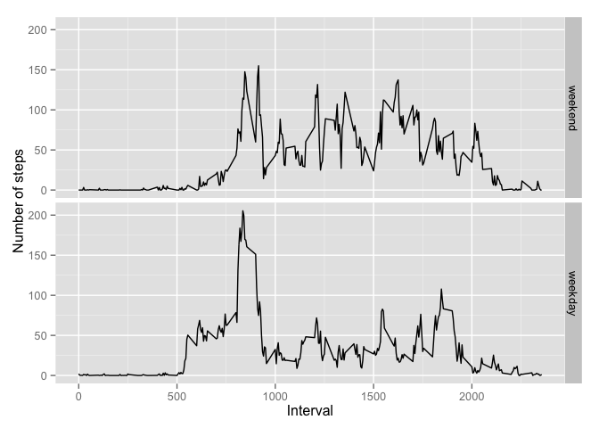

# Reproducible Research: Peer Assessment 1

We'll need some extra packages for the analysis:


```r
library(ggplot2)
library(dplyr)
```

```
## 
## Attaching package: 'dplyr'
## 
## The following objects are masked from 'package:stats':
## 
##     filter, lag
## 
## The following objects are masked from 'package:base':
## 
##     intersect, setdiff, setequal, union
```


## Loading and preprocessing the data

First, we load the raw data and transform the date variable to date format.


```r
activity <- read.csv(unz("activity.zip", "activity.csv"),
                     colClasses = c(NA, "Date", NA))
```


## What is mean total number of steps taken per day?

Now, we calculate the total number of steps taken each day and plot the distribution of the steps.


```r
daily_steps <- activity %>%
        group_by(date) %>%
        select(steps, date) %>%
        summarise(
                  sum = sum(steps, na.rm = TRUE)
                 )

qplot(sum, 
      data = daily_steps, 
      binwidth = 1000,
      xlab = "Steps per day")
```

 

On the aggregated dataset we can calculate some descriptive statistics -- including the mean and median -- of the total number of steps taken per day.


```r
summary(daily_steps$sum)
```

```
##    Min. 1st Qu.  Median    Mean 3rd Qu.    Max. 
##       0    6780   10400    9350   12800   21200
```


## What is the average daily activity pattern?


```r
daily_pattern <- activity %>%
        group_by(interval) %>%
        select(steps, interval) %>%
        summarise(
                  ave = mean(steps, na.rm = TRUE)
                 )

qplot(interval, ave, 
      data = daily_pattern, 
      geom = "line",
      xlab = "Interval",
      ylab = "Number of steps")
```

 

We can retrive which inteval contains the maximum value in the following way:


```r
daily_pattern[which.max(daily_pattern$ave), ]
```

```
## Source: local data frame [1 x 2]
## 
##     interval   ave
## 104      835 206.2
```

On average across all the days the 5-minute interval when the maximum number of steps was 835 with 206.1698 steps.

## Imputing missing values

The dataset contains many missing values:


```r
sum(is.na(activity$steps))
```

```
## [1] 2304
```

For every missing interval we impute the median value for that interval in a copy of the original dataset.


```r
activity_imputed <- activity %>%
        group_by(interval) %>%
        mutate(
                steps = ifelse(is.na(steps),
                               median(steps, na.rm = TRUE),
                               steps)
                )
```

Now, we calculate the number of steps per day in the imputed dataset and plot its distribution.


```r
daily_steps_imputed <- activity_imputed %>%
        group_by(date) %>%
        select(steps, date) %>%
        summarise(
                  sum = sum(steps)
                 )

qplot(sum, 
      data = daily_steps_imputed, 
      binwidth = 1000,
      xlab = "Steps per day")
```

 

In the imputed dataset the mean total number of steps taken per day was 9500 and the median was 10400. As expected, the median didn't change while the mean increased slightly. As we compare the histograms of the original and imputed datasets, we can see this change: the distribution is less skewed to the left. Despite the imputation, there are still many days with very few steps, which means, the distribution is still bimodal.


## Are there differences in activity patterns between weekdays and weekends?

After some transformation we can plot the two series.


```r
weekdays <- activity_imputed %>%
        mutate(
                weekday = weekdays(date) != "Saturday" &
                          weekdays(date) != "Sunday",
                weekday = factor(weekday,
                                 levels = c(FALSE, TRUE),
                                 labels = c("weekend", "weekday"))
                ) %>%
        group_by(interval, weekday) %>%
        select(steps, interval, weekday) %>%
        summarise(ave = mean(steps, na.rm = TRUE))

qplot(interval, ave, 
      data = weekdays,
      facets = weekday ~ ., 
      geom = "line",
      xlab = "Interval",
      ylab = "Number of steps")
```

 
